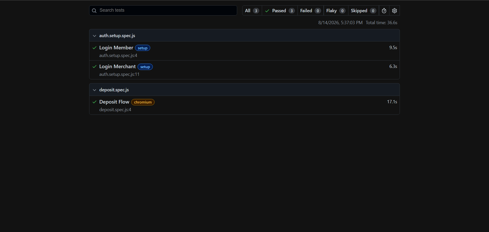

# Playwright Enterprise Automation Framework

End-to-end Playwright automation framework designed for a multi-role fintech deposit workflow.

This project automates the complete deposit lifecycle across two user roles:

- Member (customer)
- Merchant (back-office approver)

The workflow covers deposit submission, approval processing, and transaction verification, simulating a real business process instead of isolated UI actions.

## What It Tests

### Member Portal

- Login
- Submit manual deposit request
- Enter deposit amount
- Enter remitter details
- Upload payment proof
- Verify transaction history

### Merchant Portal

- Login
- Search pending deposit requests
- Review submitted details
- Approve deposit requests

### Verification

- Confirm approved deposits appear correctly in member transaction history

## Framework Features

### Page Object Model

Reusable page classes keep locators and actions separated from test logic.

```text
BasePage
 ├── LoginPage
 └── DepositPage
```

### Authentication Reuse

A dedicated setup project logs in once and stores session information using Playwright Storage State.

Authenticated sessions are reused by dependent test projects, reducing execution time and improving stability.

### Custom Fixtures

Separate fixtures are used for:

- Member workflows
- Merchant workflows

Each role runs inside its own browser context.

### Environment Management

All URLs and credentials are loaded from environment variables.

No credentials or environment-specific values are committed to the repository.

### CI/CD

GitHub Actions workflow is configured for automated execution, secret management, and artifact collection. Restricted environments may require network allowlisting or self-hosted runners.

## Tech Stack

- Playwright
- JavaScript (ES Modules)
- dotenv
- GitHub Actions

## Project Structure

```text
fixture/
├── fixture.js
└── authFixture.js

pages/
├── BasePage.js
├── LoginPage.js
└── DepositPage.js

tests/
├── auth.setup.spec.js
└── deposit.spec.js

test-data/
└── depositData.js

.github/workflows/
└── playwright.yml
```

## Running Locally

```bash
npm install
cp .env.example .env.test
npx playwright test
```

## Challenges Solved

- Multi-user workflow automation
- Session reuse using Storage State
- Environment-based configuration
- Secure credential management using GitHub Secrets
- CI/CD execution with GitHub Actions

## Debugging Example

During CI execution, a region-restricted environment returned HTTP 403 responses from GitHub-hosted runners. Failure screenshots were automatically captured and uploaded as workflow artifacts, helping identify the issue without direct access to the execution environment.

## Skills Demonstrated

- Playwright Framework Design
- Page Object Model (POM)
- Custom Fixtures
- Storage State Authentication
- Multi-Role Workflow Automation
- File Upload Automation
- Dynamic Table Handling
- Environment Configuration
- GitHub Actions CI/CD
- GitHub Secrets Management

## Screenshots



## Author

Vignesh K S
QA Engineer | Playwright Automation
